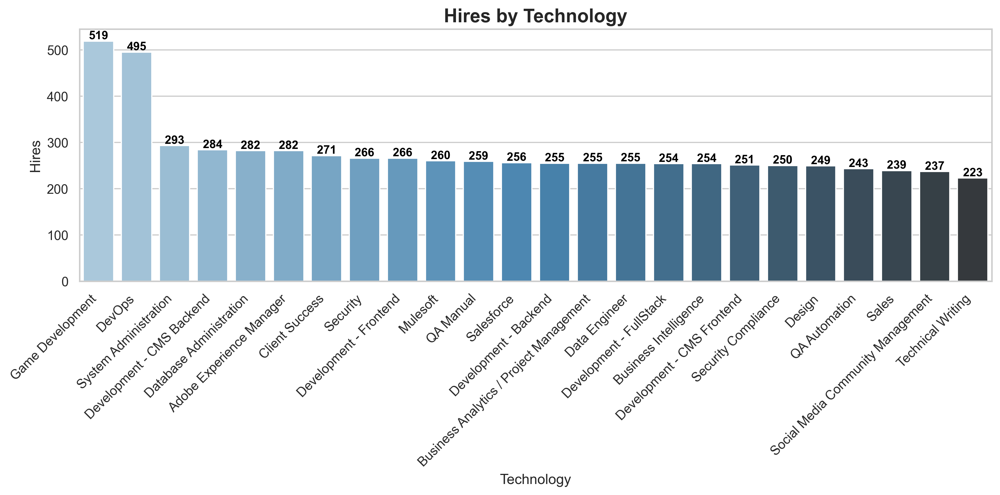
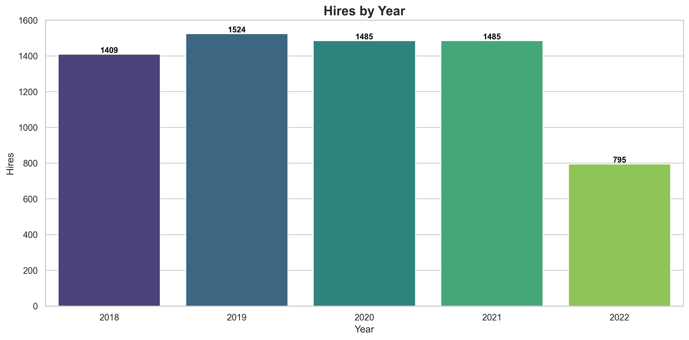
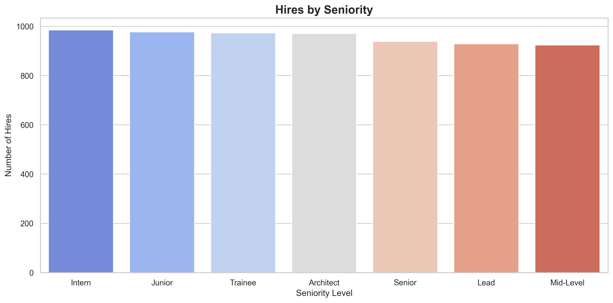
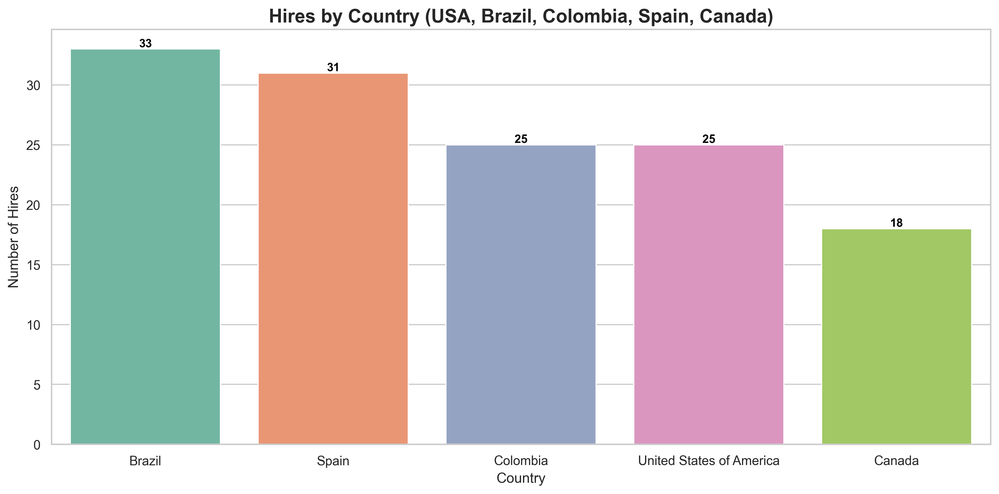
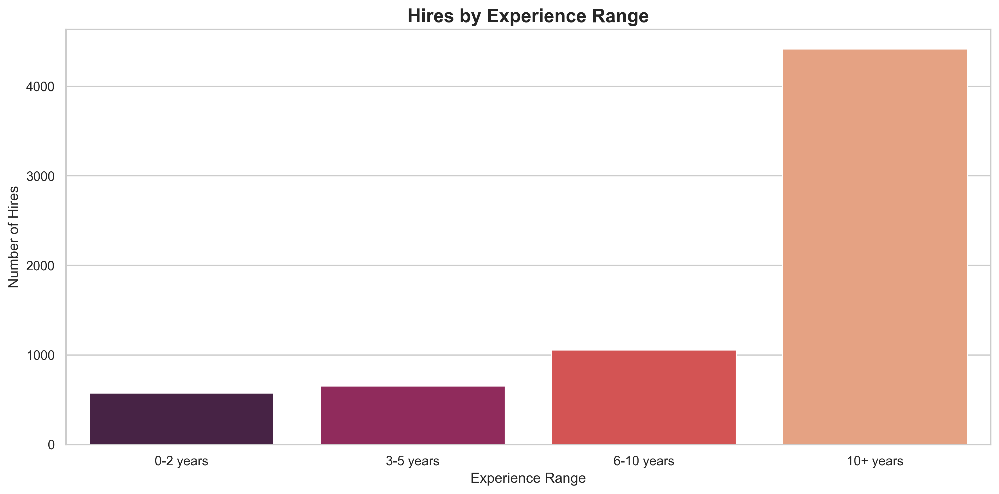
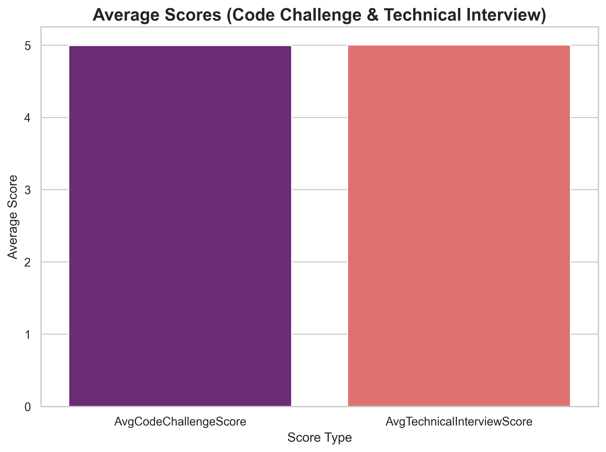
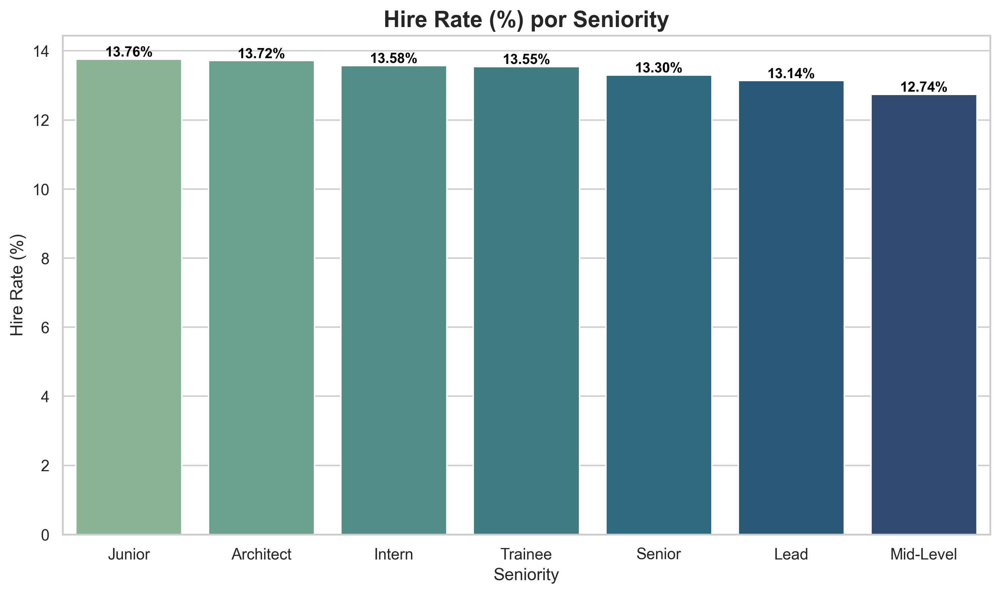
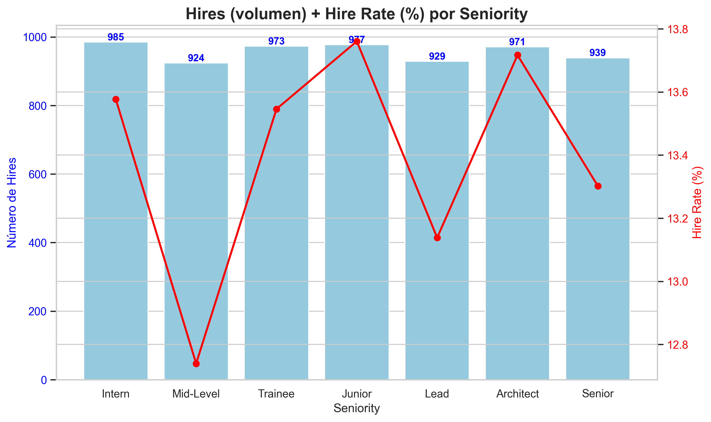

# WorkShopETL

This project implements a complete **ETL (Extract, Transform, Load)** flow to simulate a recruitment process, transform it into a **Dimensional Data Model (DDM)** in a Data Warehouse, and generate **KPIs with visualizations**.

---

## 🗂 Justification of the Dimensional Data Model (DDM)

A **star schema** was used, where:

- **Fact Table → FactHiring**  
  Contains the recruitment process event, with the key metrics.  
- **Dimension Tables** describe the analysis contexts (candidate, technology, year, seniority, and country).

### 🔹 FactHiring
- HireID (PK)  
- CandidateID (FK)  
- TechnologyID (FK)  
- YearID (FK)  
- SeniorityID (FK)  
- CountryID (FK)  
- CodeChallengeScore  
- TechnicalInterviewScore  
- YOE (Years of Experience)  
- Hired (boolean)

### 🔹 Dimensions
- **DimCandidate** → descriptive data of the candidate (name, email).  
- **DimTechnology** → applied technologies.  
- **DimYear** → application year.  
- **DimSeniority** → seniority level (Junior, Senior, etc.).  
- **DimCountry** → candidate’s country.  

👉 This allows analyzing the recruitment process metrics from multiple perspectives.

---

## 📊 KPIs and Visualizations

### 1. Hires by Technology
Number of hires by technology.  

---

### 2. Hires by Year
Number of hires by application year.  

---

### 3. Hires by Seniority
Number of hires by seniority level.  

---

### 4. Hires by Country
Hires in selected countries.  

---

### 5. Hires by Experience Range
Hires grouped by years of experience ranges.  

---

### 6. Average Scores
Average scores in the **Code Challenge** and the **Technical Interview**.  
👉 Each bar includes a label with the exact value.  

---

### 7. Hire Rate (%) by Seniority
Proportion of candidates hired compared to the total number of applicants, by seniority level.  

---

### 8. Hires (volume) + Hire Rate (%) by Seniority
Combined chart that shows:  
- **Blue bars:** number of hires (absolute volume).  
- **Red line:** Hire Rate (%) by seniority.  

This allows comparing **quantity** and **efficiency** in a single chart.  

---

## 🛠 Technologies Used
- **Python** → ETL and visualization generation.  
- **Pandas & SQLAlchemy** → data transformation and loading.  
- **MySQL** → Data Warehouse.  
- **Matplotlib & Seaborn** → visualizations.  

---

## 📑 Consolidated Report
All visualizations are also available in a **single PDF**:  

📂 `visualizations_output/report.pdf`  

---

## 📌 Conclusions
- The dimensional model allows analyzing hires from multiple perspectives.  
- The KPIs reveal differences between hire volumes and success rates by technology, year, seniority, and country.  
- The combined analysis (volume + Hire Rate) provides deeper insights into the **efficiency of the recruitment process**.  
